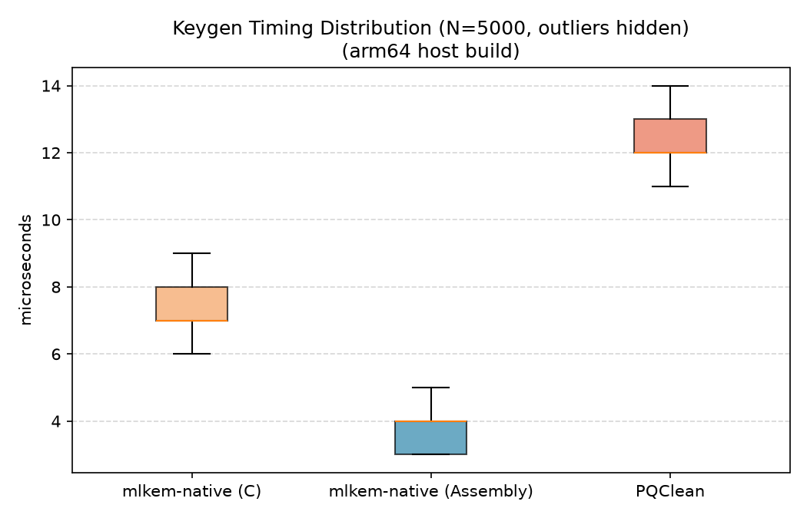
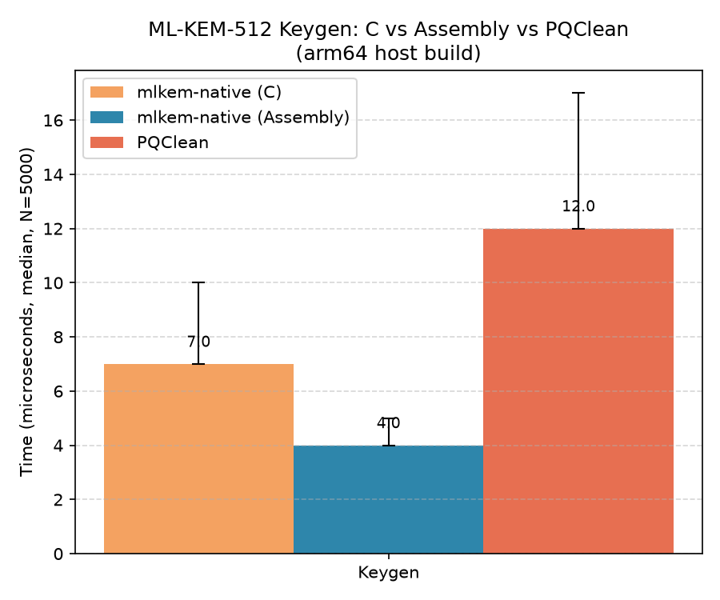
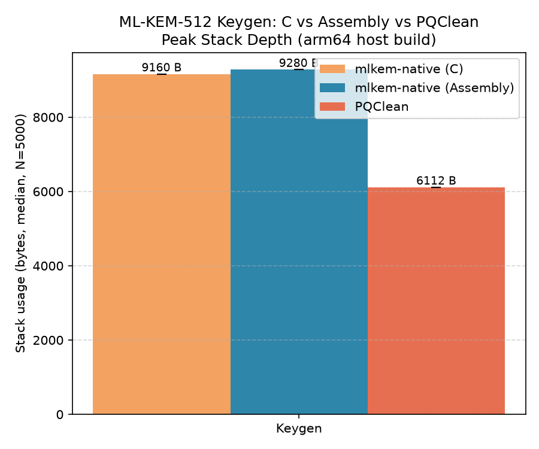

# ML-KEM Keygen Benchmark — Methodology & Results (`mlkem-native`)

## Objective

This benchmark measures two properties of the `crypto_kem_keypair()` function from **mlkem-native** (an implementation of **ML-KEM**, the NIST-standardized post-quantum key-encapsulation mechanism, formerly known as Kyber):

1. **Latency** — how long a single key-generation call takes.
2. **Stack footprint** — how much stack memory a single key-generation call uses.

Both matter for real-world deployment: latency affects throughput in protocols like TLS that generate keys frequently, and stack footprint often determines whether a lattice-based scheme like ML-KEM can even run on memory-constrained embedded devices (smart cards, microcontrollers, HSMs).

---

## Methodology

### 1. Measurement unit and sample size

Rather than timing one call, the benchmark runs `crypto_kem_keypair()` **50,000 times** in a tight loop and records a separate latency and stack-usage sample for every single call. A large sample size is used deliberately: key generation is fast (microseconds) and can be affected by transient system noise (OS scheduling, cache state, frequency scaling), so a single measurement is not representative. Collecting tens of thousands of samples lets the later statistics distinguish the algorithm's true typical cost from occasional outliers.

### 2. Warmup phase

Before any measurement is recorded, the benchmark runs `crypto_kem_keypair()` repeatedly for **100 milliseconds** and discards every result. This warmup step exists to let the CPU reach a steady state — instruction/data caches populated, branch predictors trained, CPU frequency scaling settled — and to let any one-time lazy initialization inside the library happen before the timed region starts. Without this step, the first several "real" samples would be artificially slow and would skew the statistics.

### 3. Timing methodology

Each call is timed individually using `CLOCK_MONOTONIC`, a clock that only counts forward and is unaffected by system clock adjustments (NTP sync, daylight saving, manual clock changes). The clock is read immediately before and immediately after the call, and the difference (in microseconds) is stored as that iteration's latency sample. Using a monotonic clock rather than wall-clock time is standard practice for benchmarking, since it guarantees the measured duration can never appear negative or be distorted by a clock correction happening mid-call.

### 4. Stack-usage methodology ("stack poisoning" / watermarking)

Measuring stack usage is harder than timing, because there's no library call that reports it directly. The benchmark uses a well-established technique called **stack watermarking**:

- **Poison:** Immediately before the call under test, a region of memory just below the current stack pointer (with a small safety gap, since the harness itself is still using nearby stack memory) is filled with a fixed marker byte (`0xAA`).
- **Execute:** The function under test runs. Since local variables of any function it calls are placed on the stack, if the call needs, say, 3 KB of stack space, it will overwrite roughly 3 KB of that poisoned region as it executes.
- **Scan:** After the call returns, the poisoned region is scanned from its deepest point upward for the first byte that no longer matches the marker. Everything below that point was touched by the call, so the distance from that point to the top of the region is taken as that call's maximum stack usage.

Compiler memory barriers are placed around the poisoning and the call itself to prevent the compiler from reordering instructions in a way that would invalidate the measurement.

This technique has one built-in limitation the benchmark checks for automatically: if a call's actual stack usage exceeds the size of the poisoned region, the measurement under-reports the true value (there's no more marker byte left to detect). The benchmark poisons a 16 KB region and emits a warning if any recorded sample reaches that boundary, flagging that the region size should be increased and the results re-run.

### 5. Statistical summary

For both the latency and stack-usage sample sets, the following statistics are computed over all 50,000 samples:

- **Mean** and **standard deviation** (latency only) — overall central tendency and variability.
- **Median** and **99th percentile (p99)** — computed by sorting the samples, these are more robust to outliers than the mean and better represent "typical" and "worst common case" performance respectively.
- **Min / max** — the fastest/lightest and slowest/heaviest individual calls observed.

### 6. Output and reproducibility

Every individual sample (not just the summary statistics) is written to two CSV files — one for timing, one for stack usage — tagged with a library name field. Preserving raw per-iteration data, rather than only the aggregate numbers, means the results can later be reloaded to plot distributions, compare against other libraries' runs using the same CSV schema, or recompute statistics without re-running the benchmark.


---
## Appendix: Fully annotated source

The complete source file, with a comment on essentially every line explaining what it does, is included below for line-by-line reference.

```c
#define _POSIX_C_SOURCE 199309L        // Enable POSIX.1b features (needed for clock_gettime, CLOCK_MONOTONIC)
#include <stdio.h>                      // printf, fprintf, fopen, fclose
#include <stdlib.h>                     // malloc, free, qsort
#include <string.h>                     // memcpy
#include <time.h>                       // clock_gettime, struct timespec
#include <math.h>                       // sqrt (for stddev calculation)
#include <stdint.h>                     // fixed-width integer types (uint8_t, uintptr_t, etc.)
#include <sys/random.h>                 // getrandom() (Linux) / getentropy() (macOS)
#include <errno.h>                      // errno, EINTR
#include "mlkem_native/mlkem_native.h"  // ML-KEM (Kyber) API: crypto_kem_keypair, key size macros, param set macro

#ifndef NUM_ITERS
#define NUM_ITERS 50000                 // Default number of timed keygen iterations (overridable at compile time)
#endif

#ifndef WARMUP_ITERS
#define WARMUP_ITERS 100                // Documented warmup iteration count (actual warmup loop below is time-based, not count-based)
#endif

#ifndef LIB_NAME
#define LIB_NAME "mlkem-native"         // Library name tag written into CSV output rows
#endif

#ifndef OUT_FILE
#define OUT_FILE "results_mlkem_native_time.csv"   // Output CSV file path for timing results
#endif

#ifndef STACK_FILE
#define STACK_FILE "results_mlkem_native_stack.csv" // Output CSV file path for stack-usage results
#endif

#ifndef POISON_REGION_BYTES
#define POISON_REGION_BYTES (16 * 1024) // Size of the stack region pre-filled with a marker byte, used to detect how deep the stack was used
#endif

#define POISON_BYTE 0xAA                // Marker byte written into the poison region before each call
#define GUARD_BYTES 256                 // Safety gap below the current stack pointer before poisoning starts, to avoid clobbering live stack data

// Returns the current wall-clock time in microseconds using a monotonic (non-adjustable) clock.
static double now_us(void) {
    struct timespec ts;                       // Holds seconds + nanoseconds since some fixed starting point
    clock_gettime(CLOCK_MONOTONIC, &ts);       // Fill ts with current monotonic time (immune to system clock changes)
    return (double)ts.tv_sec * 1e6 + (double)ts.tv_nsec / 1e3;  // Convert seconds+nanoseconds into a single microsecond value
}

// Comparator for qsort() to sort an array of doubles in ascending order.
static int cmp_double(const void *a, const void *b) {
    double da = *(const double *)a, db = *(const double *)b;  // Dereference the two values being compared
    return (da > db) - (da < db);                              // Returns 1, -1, or 0 depending on relative order
}

// Comparator for qsort() to sort an array of longs in ascending order.
static int cmp_long(const void *a, const void *b) {
    long la = *(const long *)a, lb = *(const long *)b;         // Dereference the two values being compared
    return (la > lb) - (la < lb);                                // Returns 1, -1, or 0 depending on relative order
}

// Architecture-specific: reads the current stack pointer register directly.
#if defined(__x86_64__) || defined(__i386__)
static inline uintptr_t get_sp(void) {
    uintptr_t sp;                                              // Will hold the stack pointer value
    __asm__ __volatile__("mov %%rsp, %0" : "=r"(sp));          // Inline assembly: copy the rsp register into sp (x86/x86_64)
    return sp;                                                  // Return the captured stack pointer
}
#elif defined(__aarch64__) || defined(__arm__)
static inline uintptr_t get_sp(void) {
    uintptr_t sp;                                              // Will hold the stack pointer value
    __asm__ __volatile__("mov %0, sp" : "=r"(sp));             // Inline assembly: copy the sp register into sp (ARM/AArch64)
    return sp;                                                  // Return the captured stack pointer
}
#else
// Fallback for unsupported architectures: approximates the stack pointer using the address of a local variable.
static inline uintptr_t get_sp(void) {
    volatile int dummy;                                        // A local stack variable
    return (uintptr_t)&dummy;                                  // Its address approximates the current stack pointer location
}
#endif

// Fills a region of stack memory with a known marker byte (POISON_BYTE) so later code can detect how much of it got overwritten.
static void poison_stack_region(volatile uint8_t *base, size_t len) {
    for (size_t i = 0; i < len; i++) {   // Walk every byte in the region
        base[i] = POISON_BYTE;           // Overwrite it with the marker value
    }
}

// Scans the poisoned region from the bottom (deepest address) upward to find how many bytes were disturbed (i.e., actually used by the called function's stack frames).
static size_t scan_stack_depth(volatile uint8_t *base, size_t len) {
    size_t i;
    for (i = 0; i < len; i++) {                 // Scan forward through the region
        if (base[i] != POISON_BYTE) {           // First byte that no longer matches the poison marker...
            return len - i;                     // ...marks the deepest point of stack usage; report bytes used from there to the end
        }
    }
    return 0;                                    // Nothing was disturbed -> stack usage measured as 0
}

// Runs one crypto_kem_keypair() call while poisoning the stack beforehand and measuring both elapsed time and stack depth used.
static size_t benchmark_keypair(uint8_t *pk, uint8_t *sk, int *call_result, double *elapsed_us) {
    uintptr_t sp = get_sp();                                              // Capture current stack pointer as a reference point
    volatile uint8_t *poison_top = (volatile uint8_t *)(sp - GUARD_BYTES);// Start poisoning a bit below current SP, leaving a safety guard
    volatile uint8_t *poison_base = poison_top - POISON_REGION_BYTES;    // Bottom of the poisoned region (deepest address)
    poison_stack_region(poison_base, POISON_REGION_BYTES);               // Fill the region with the marker byte
    __asm__ __volatile__("" ::: "memory");                                // Compiler memory barrier: prevent reordering poisoning after the timed call
    double t0 = now_us();                                                 // Record start time
    *call_result = crypto_kem_keypair(pk, sk);                            // The actual operation under test: generate an ML-KEM keypair
    double t1 = now_us();                                                 // Record end time
    *elapsed_us = t1 - t0;                                                // Compute elapsed microseconds for this call
    __asm__ __volatile__("" ::: "memory");                                // Compiler memory barrier: prevent reordering the scan before the call completes
    return scan_stack_depth(poison_base, POISON_REGION_BYTES);            // Measure how deep into the poisoned region the call wrote (i.e., stack usage)
}

// Cryptographically secure random byte source required by the ML-KEM library; fills 'out' with 'outlen' random bytes.
int randombytes(uint8_t *out, size_t outlen) {
#ifdef __APPLE__
    size_t total_read = 0;
    while (total_read < outlen) {                          // Loop until the full buffer is filled
        size_t chunk = outlen - total_read;                // Remaining bytes needed
        if (chunk > 256) chunk = 256;                       // getentropy() only allows up to 256 bytes per call, so cap chunk size
        if (getentropy(out + total_read, chunk) != 0) {     // Request 'chunk' random bytes from the OS
            if (errno == EINTR) continue;                   // Retry if interrupted by a signal
            return -1;                                       // Any other error: report failure
        }
        total_read += chunk;                                 // Advance the fill position
    }
    return 0;                                                 // Success
#else
    size_t total_read = 0;
    while (total_read < outlen) {                          // Loop until the full buffer is filled
        ssize_t res = getrandom(out + total_read, outlen - total_read, 0); // Ask the kernel for random bytes (Linux)
        if (res < 0) {                                        // getrandom() failed
            if (errno == EINTR) continue;                   // Retry if interrupted by a signal
            return -1;                                        // Any other error: report failure
        }
        total_read += res;                                    // Advance the fill position by however many bytes were actually returned
    }
    return 0;                                                 // Success
#endif
}

// Computes and prints summary statistics (mean/median/stddev/min/max/p99) for an array of timing samples, and writes each raw sample to the CSV.
static void report_time(const char *label, double *samples, int n, FILE *csv) {
    double sum = 0.0, min = samples[0], max = samples[0];   // Running accumulators, seeded with the first sample
    int i;
    double *sorted = malloc((size_t)n * sizeof(double));    // Scratch buffer for computing median/percentile via sorting
    if (!sorted) {
        fprintf(stderr, "malloc failed in report_time()\n"); // Report allocation failure
        return;                                                // Abort this report (samples still lost, but avoids crash)
    }
    memcpy(sorted, samples, (size_t)n * sizeof(double));      // Copy samples so the original array order is preserved
    qsort(sorted, (size_t)n, sizeof(double), cmp_double);      // Sort the copy ascending, needed for median/p99
    for (i = 0; i < n; i++) {                                  // Single pass to compute sum, min, and max
        sum += samples[i];
        if (samples[i] < min) min = samples[i];
        if (samples[i] > max) max = samples[i];
    }
    double mean = sum / n;                                      // Arithmetic mean of all samples
    double sq = 0.0;
    for (i = 0; i < n; i++) sq += (samples[i] - mean) * (samples[i] - mean); // Sum of squared deviations from the mean
    double stddev = sqrt(sq / n);                               // Population standard deviation
    double median = sorted[n / 2];                              // Middle value of the sorted samples
    double p99 = sorted[(int)(0.99 * n)];                       // 99th percentile value
    printf("%-10s mean=%.3f us median=%.3f us stddev=%.3f min=%.3f max=%.3f p99=%.3f\n", // Human-readable summary line
           label, mean, median, stddev, min, max, p99);
    for (i = 0; i < n; i++) fprintf(csv, "%s,%s,%d,%.4f\n", LIB_NAME, label, i, samples[i]); // Write each raw sample as a CSV row
    free(sorted);                                                // Release the scratch buffer
}

// Computes and prints summary statistics for an array of stack-usage samples (in bytes), and writes each raw sample to the CSV.
static void report_stack(const char *label, long *samples, int n, FILE *csv) {
    long sum = 0, min = samples[0], max = samples[0];        // Running accumulators, seeded with the first sample
    int i;
    long *sorted = malloc((size_t)n * sizeof(long));          // Scratch buffer for computing median/percentile via sorting
    if (!sorted) {
        fprintf(stderr, "malloc failed in report_stack()\n"); // Report allocation failure
        return;                                                 // Abort this report
    }
    memcpy(sorted, samples, (size_t)n * sizeof(long));         // Copy samples so original order is preserved
    qsort(sorted, (size_t)n, sizeof(long), cmp_long);           // Sort the copy ascending
    for (i = 0; i < n; i++) {                                   // Single pass to compute sum, min, and max
        sum += samples[i];
        if (samples[i] < min) min = samples[i];
        if (samples[i] > max) max = samples[i];
    }
    double mean = (double)sum / n;                               // Average stack usage in bytes
    long median = sorted[n / 2];                                 // Middle value of the sorted samples
    long p99 = sorted[(int)(0.99 * n)];                          // 99th percentile value
    printf("%-10s stack: mean=%.1f B (%.2f KB) median=%ld B min=%ld max=%ld p99=%ld\n", // Human-readable summary line
           label, mean, mean / 1024.0, median, min, max, p99);
    if (max >= (long)POISON_REGION_BYTES)                        // Sanity check: if usage reached the full poison region...
        fprintf(stderr, "WARNING: measured stack usage reached the edge of the %d-byte poison region -- "
                         "POISON_REGION_BYTES should be increased, the max value below is not trustworthy.\n",
                POISON_REGION_BYTES);                              // ...warn that the true usage may have been truncated/underestimated
    for (i = 0; i < n; i++) fprintf(csv, "%s,%s,%d,%ld\n", LIB_NAME, label, i, samples[i]); // Write each raw sample as a CSV row
    free(sorted);                                                 // Release the scratch buffer
}

int main(void) {
    uint8_t pk[CRYPTO_PUBLICKEYBYTES];          // Buffer sized for the ML-KEM public key
    uint8_t sk[CRYPTO_SECRETKEYBYTES];          // Buffer sized for the ML-KEM secret key
    int i;
    double *keygen_t = malloc(NUM_ITERS * sizeof(double));     // Array to hold per-iteration timing samples
    long *keygen_stack = malloc(NUM_ITERS * sizeof(long));     // Array to hold per-iteration stack-usage samples
    if (!keygen_t || !keygen_stack) {                            // Check both allocations succeeded
        fprintf(stderr, "malloc failed\n");
        free(keygen_t);                                           // Free whichever succeeded (free(NULL) is a no-op)
        free(keygen_stack);
        return 1;                                                  // Exit with failure status
    }

    FILE *time_csv = fopen(OUT_FILE, "w");                       // Open timing results CSV for writing (truncates if it exists)
    fprintf(time_csv, "library,operation,iter,microseconds\n");   // Write CSV header row

    FILE *stack_csv = fopen(STACK_FILE, "w");                    // Open stack-usage results CSV for writing
    fprintf(stack_csv, "library,operation,iter,stack_bytes\n");   // Write CSV header row

    int call_result;
    double warmup_start = now_us();                               // Mark the start of the warmup phase

    while (now_us() - warmup_start < 100000.0) {                  // Run warmup calls for 100,000 microseconds (100 ms) to stabilize CPU caches/frequency
        double warmup_time;
        (void)benchmark_keypair(pk, sk, &call_result, &warmup_time); // Discard result/timing; purpose is only to "warm up" the system
    }

    for (i = 0; i < NUM_ITERS; i++) {                             // Main measurement loop, one keygen per iteration
        keygen_stack[i] = (long)benchmark_keypair(pk, sk, &call_result, &keygen_t[i]); // Run + measure timing and stack depth for this call
        if (call_result != 0) {                                    // crypto_kem_keypair() returned an error code
            fprintf(stderr, "crypto_kem_keypair() failed at iteration %d\n", i); // Report which iteration failed
            fclose(time_csv);                                       // Clean up open file handles before exiting
            fclose(stack_csv);
            free(keygen_t);                                          // Clean up allocated memory before exiting
            free(keygen_stack);
            return 1;                                                 // Exit with failure status
        }
    }

    printf("=== mlkem-native ML-KEM-%d (Keygen Only) (N=%d, warmup=%d) ===\n", // Print benchmark header/summary banner
           MLK_CONFIG_PARAMETER_SET, NUM_ITERS, WARMUP_ITERS);

    report_time("keygen", keygen_t, NUM_ITERS, time_csv);          // Compute + print + save timing statistics
    report_stack("keygen", keygen_stack, NUM_ITERS, stack_csv);    // Compute + print + save stack-usage statistics

    fclose(time_csv);                                                // Close the timing CSV file
    fclose(stack_csv);                                               // Close the stack-usage CSV file
    free(keygen_t);                                                  // Release the timing samples array
    free(keygen_stack);                                              // Release the stack-usage samples array

    return 0;                                                         // Successful completion
}
```
---

## System Specifications

| Component | Specification |
| :--- | :--- |
| **System Model** | Apple MacBook Air (M4, 2025) |
| **Processor (CPU)** | Apple M4 Chip (10-Core CPU) |
| **Graphics (dGPU)** | Not Available (No Dedicated GPU) |
| **Graphics (iGPU)** | Apple M4 Integrated 8-Core GPU |
| **Memory (RAM)** | 16 GB Unified Memory |
| **Swap Space** | Dynamic macOS Swap Memory |
| **Display** | 13.6" 2560 x 1664 @ 60 Hz (Built-in Liquid Retina Display) |
| **Audio** | Enabled |

---

## Results

| Distribution | Timing Comparison |
| :---: | :---: |
|  |  |

| Space Comparison |
| :---: |
||

---

