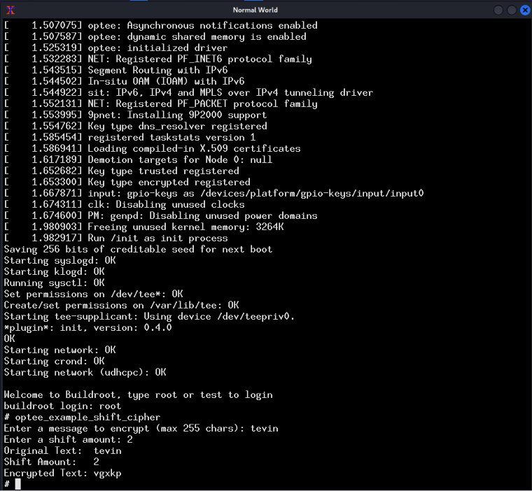
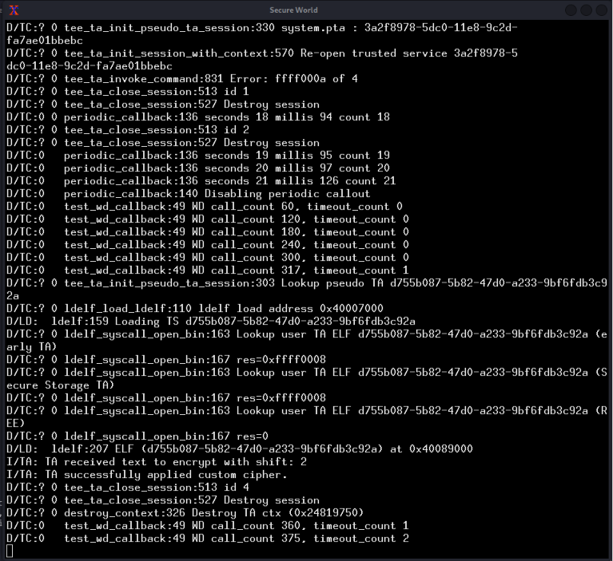

# Shift Cipher — OP-TEE TA/CA

A step up from the previous example. Instead of just passing integers, this one sends a string across the TrustZone boundary, shifts each character's ASCII value inside the Secure World, and gets the encrypted text back.

---

## Directory Structure

```
optee_examples/
└── shift_cipher/
    ├── CMakeLists.txt
    ├── host/
    │   └── main.c
    └── ta/
        ├── Makefile
        ├── shift_cipher_ta.c
        ├── sub.mk
        ├── user_ta_header_defines.h
        └── include/
            └── shift_cipher_ta.h
```

## OUTPUT

| Normal World (Client App) | Secure World (Trusted App) |
| :---: | :---: |
|  |  |

---

## Full Code

### `ta/include/shift_cipher_ta.h`

```c
#ifndef TA_SHIFT_CIPHER_H
#define TA_SHIFT_CIPHER_H

#define TA_SHIFT_CIPHER_UUID \
    { 0xd755b087, 0x5b82, 0x47d0, \
        { 0x12, 0x34, 0x12, 0x34, 0x12, 0x34, 0x12, 0x34 } }

#define TA_CMD_SHIFT_CIPHER 1

#endif /*TA_SHIFT_CIPHER_H*/
```

---

### `ta/user_ta_header_defines.h`

```c
#ifndef USER_TA_HEADER_DEFINES_H
#define USER_TA_HEADER_DEFINES_H

#include <shift_cipher_ta.h>

#define TA_UUID         TA_SHIFT_CIPHER_UUID
#define TA_FLAGS        TA_FLAG_EXEC_DDR
#define TA_STACK_SIZE   (2 * 1024)
#define TA_DATA_SIZE    (32 * 1024)

#endif /*USER_TA_HEADER_DEFINES_H*/
```

---

### `ta/shift_cipher_ta.c`

```c
#include <tee_internal_api.h>
#include <tee_internal_api_extensions.h>
#include "shift_cipher_ta.h"

TEE_Result TA_CreateEntryPoint(void) { return TEE_SUCCESS; }
void TA_DestroyEntryPoint(void) { }
void TA_CloseSessionEntryPoint(void __maybe_unused *sess_ctx) { }

TEE_Result TA_OpenSessionEntryPoint(uint32_t param_types,
                                    TEE_Param __maybe_unused params[4],
                                    void __maybe_unused **sess_ctx) {
    uint32_t exp_param_types = TEE_PARAM_TYPES(TEE_PARAM_TYPE_NONE,
                                               TEE_PARAM_TYPE_NONE,
                                               TEE_PARAM_TYPE_NONE,
                                               TEE_PARAM_TYPE_NONE);
    if (param_types != exp_param_types)
        return TEE_ERROR_BAD_PARAMETERS;
    return TEE_SUCCESS;
}

static TEE_Result custom_shift_cipher(uint32_t param_types, TEE_Param params[4]) {

    uint32_t exp_param_types = TEE_PARAM_TYPES(TEE_PARAM_TYPE_MEMREF_INOUT,
                                               TEE_PARAM_TYPE_VALUE_INPUT,
                                               TEE_PARAM_TYPE_NONE,
                                               TEE_PARAM_TYPE_NONE);
    if (param_types != exp_param_types)
        return TEE_ERROR_BAD_PARAMETERS;

    char *text      = (char *)params[0].memref.buffer;
    uint32_t text_len = params[0].memref.size;
    uint32_t shift  = params[1].value.a;

    IMSG("TA received text to encrypt with shift: %u", shift);

    for (uint32_t i = 0; i < text_len; i++) {
        if (text[i] >= 'A' && text[i] <= 'Z') {
            text[i] = ((text[i] - 'A' + shift) % 26) + 'A';
        }
        else if (text[i] >= 'a' && text[i] <= 'z') {
            text[i] = ((text[i] - 'a' + shift) % 26) + 'a';
        }
    }

    IMSG("TA successfully applied custom cipher.");
    return TEE_SUCCESS;
}

TEE_Result TA_InvokeCommandEntryPoint(void __maybe_unused *sess_ctx,
                                      uint32_t cmd_id, uint32_t param_types,
                                      TEE_Param params[4]) {
    switch (cmd_id) {
    case TA_CMD_SHIFT_CIPHER:
        return custom_shift_cipher(param_types, params);
    default:
        return TEE_ERROR_BAD_PARAMETERS;
    }
}
```

---

### `host/main.c`

```c
#include <err.h>
#include <stdio.h>
#include <string.h>
#include <tee_client_api.h>
#include "shift_cipher_ta.h"

int main(void) {
    TEEC_Context ctx;
    TEEC_Session sess;
    TEEC_Operation op;
    TEEC_UUID uuid = TA_SHIFT_CIPHER_UUID;
    uint32_t err_origin;

    char message[256] = {0};
    uint32_t shift_amount = 0;

    printf("Enter a message to encrypt (max 255 chars): ");
    if (fgets(message, sizeof(message), stdin) != NULL) {
        message[strcspn(message, "\n")] = 0;
    }

    printf("Enter a shift amount: ");
    if (scanf("%u", &shift_amount) != 1) {
        errx(1, "Invalid shift input");
    }

    if (TEEC_InitializeContext(NULL, &ctx) != TEEC_SUCCESS)
        errx(1, "TEEC_InitializeContext failed");

    if (TEEC_OpenSession(&ctx, &sess, &uuid, TEEC_LOGIN_PUBLIC, NULL, NULL, &err_origin) != TEEC_SUCCESS)
        errx(1, "TEEC_OpenSession failed");

    memset(&op, 0, sizeof(op));
    op.paramTypes = TEEC_PARAM_TYPES(TEEC_MEMREF_TEMP_INOUT,
                                     TEEC_VALUE_INPUT,
                                     TEEC_NONE, TEEC_NONE);

    op.params[0].tmpref.buffer = message;
    op.params[0].tmpref.size   = strlen(message);
    op.params[1].value.a       = shift_amount;

    printf("Original Text:  %s\n", message);
    printf("Shift Amount:   %u\n", shift_amount);

    if (TEEC_InvokeCommand(&sess, TA_CMD_SHIFT_CIPHER, &op, &err_origin) != TEEC_SUCCESS)
        errx(1, "TEEC_InvokeCommand failed");

    printf("Encrypted Text: %s\n", (char *)op.params[0].tmpref.buffer);

    TEEC_CloseSession(&sess);
    TEEC_FinalizeContext(&ctx);

    return 0;
}
```

---

### `CMakeLists.txt`

```cmake
project (optee_example_shift_cipher C)

set (SRC host/main.c)

add_executable (${PROJECT_NAME} ${SRC})

target_include_directories(${PROJECT_NAME}
                           PRIVATE ta/include
                           PRIVATE include)

target_link_libraries (${PROJECT_NAME} PRIVATE teec)

install (TARGETS ${PROJECT_NAME} DESTINATION ${CMAKE_INSTALL_BINDIR})
```

---

### `ta/Makefile`

```makefile
CFG_TEE_TA_LOG_LEVEL ?= 4

BINARY = 12345678-1234-1234-1234-123412341234

-include $(TA_DEV_KIT_DIR)/mk/ta_dev_kit.mk

ifeq ($(wildcard $(TA_DEV_KIT_DIR)/mk/ta_dev_kit.mk), )
clean:
	@echo 'Note: $$(TA_DEV_KIT_DIR)/mk/ta_dev_kit.mk not found, cannot clean TA'
	@echo 'Note: TA_DEV_KIT_DIR=$(TA_DEV_KIT_DIR)'
endif
```

---

### `ta/sub.mk`

```makefile
global-incdirs-y += include
srcs-y += shift_cipher_ta.c
```

---

## Explanation

### Shared Header (`shift_cipher_ta.h`)
Same role as before — defines the UUID and command ID so both sides agree. Command ID is `1` here (was `0` in the sum_digits example), just to show it's arbitrary as long as both sides match.

### `user_ta_header_defines.h`
Sets the UUID, memory limits, and flags for the TA. `TA_FLAG_EXEC_DDR` means the TA code runs from DDR memory. Stack is 2KB, heap is 32KB — plenty for a cipher operation on short strings.

### Trusted Application (`shift_cipher_ta.c`)
The boilerplate entry points are the same as any OP-TEE TA. The real work is in `custom_shift_cipher()`. It receives the message as a `MEMREF_INOUT` (a pointer to a shared memory buffer) and the shift value as a `VALUE_INPUT`. It loops over each character — if it's a letter, it shifts the ASCII value by the given amount and wraps around at 26 using modulo. Non-letter characters (spaces, punctuation, numbers) are left untouched. Because the buffer is `INOUT`, the TA writes the result directly back into the same memory, so the CA sees the encrypted text without needing a separate output buffer.

### Client Application (`main.c`)
The CA reads the message with `fgets` (safer than `scanf` for strings) and strips the trailing newline. It then opens a session, packs the operation with `MEMREF_TEMP_INOUT` for the string and `VALUE_INPUT` for the shift, and calls `TEEC_InvokeCommand`. After the TA returns, `op.params[0].tmpref.buffer` points to the same `message` array — now overwritten with the encrypted text — and the CA just prints it.

---
