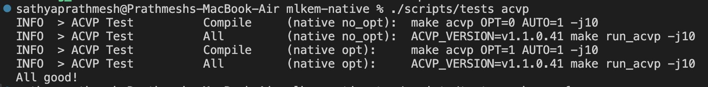
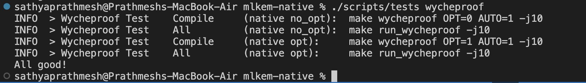

# NIST Standards Verification Report for the ML-KEM Implementation Used in mlkem-native

---

## 1. Purpose of the Report

### 1.1 Objective

This report is prepared to verify whether the post-quantum cryptographic algorithm implemented in this project is standardized by the National Institute of Standards and Technology (NIST).

The objective of this assessment is to:

- Identify the cryptographic algorithm implemented in the project.
- Verify whether the algorithm is included in the NIST Post-Quantum Cryptography standards.
- Confirm that the algorithm corresponds to the specifications defined in NIST FIPS 203 (Module-Lattice-Based Key-Encapsulation Mechanism – ML-KEM).
- Document the verification and validation results for the implementation used in this project.

---

## 2. NIST Standard Information

| Specification | Details |
|---------------|---------|
| Standard Name | NIST FIPS 203 |
| Standard Title | Module-Lattice-Based Key-Encapsulation Mechanism (ML-KEM) |
| Standardized Algorithm | ML-KEM |
| Parameter Set Verified | ML-KEM-512 |
| Library Evaluated | mlkem-native |
| Standardization Authority | National Institute of Standards and Technology (NIST) |
| Verification Basis | Algorithm standardized in NIST FIPS 203 |
| Publication Date | August 13, 2024 |

---

## 3. Verification of the ML-KEM Implementation

The `mlkem-native` library was examined to identify the post-quantum cryptographic algorithm used in its implementation. Documentation and implementation details indicate that the library implements the Module-Lattice-Based Key-Encapsulation Mechanism (ML-KEM) as specified in NIST FIPS 203.

For this project, the ML-KEM-512 parameter set was evaluated. Verification confirmed that the algorithm implemented by `mlkem-native` corresponds to the standardized ML-KEM algorithm published by the National Institute of Standards and Technology (NIST).

Therefore, the algorithm used in this project is a NIST-standardized post-quantum cryptographic algorithm.

---

## 4. Verification Methodology

The verification process consisted of the following activities:

1. Reviewing the official NIST FIPS 203 specification for the Module-Lattice-Based Key-Encapsulation Mechanism (ML-KEM).
2. Identifying the cryptographic algorithm implemented by the `mlkem-native` library.
3. Verifying that the implemented algorithm corresponds to the standardized ML-KEM algorithm defined in FIPS 203.
4. Comparing the supported parameter set (ML-KEM-512) with the parameter set defined in the NIST standard.
5. Performing implementation-level validation using the built-in validation framework provided by the `mlkem-native` repository.

### 4.1 Verification Procedure

The NIST standards verification was performed using the following procedure:

1. The official NIST FIPS 203 specification was reviewed to identify the standardized ML-KEM algorithm and its supported parameter sets.

2. The official documentation and source code of the `mlkem-native` library were examined to identify the cryptographic algorithm implemented by the library.

3. The implemented algorithm was confirmed to be ML-KEM, and the ML-KEM-512 parameter set used in this project was verified against the parameter sets defined in NIST FIPS 203.

4. The project implementation files were integrated into the original `mlkem-native` repository.

5. The built-in ACVP and Wycheproof validation frameworks provided by the `mlkem-native` repository were executed to validate the correctness of the implementation.

6. The validation results were reviewed to confirm that all test cases passed successfully.

7. Based on the successful algorithm-level and implementation-level verification, the ML-KEM implementation used in this project was confirmed to conform to the NIST FIPS 203 specification.

---

## 5. Algorithm Verification Summary

The verification process confirmed that the cryptographic algorithm implemented by the `mlkem-native` library corresponds to the Module-Lattice-Based Key-Encapsulation Mechanism (ML-KEM) standardized by the National Institute of Standards and Technology (NIST) in FIPS 203.

The implementation supports the ML-KEM-512 parameter set evaluated in this project. The assessment established that the algorithm implemented by the library corresponds to the ML-KEM specification defined in NIST FIPS 203.

Consequently, the cryptographic algorithm used in this project is a NIST-standardized post-quantum cryptographic algorithm.

---

## 6. Findings

The verification produced the following findings:

- The `mlkem-native` library implements the ML-KEM algorithm standardized by NIST in FIPS 203.
- The ML-KEM-512 parameter set evaluated in this project is defined in NIST FIPS 203.
- The cryptographic algorithm implemented by the `mlkem-native` library corresponds to the standardized ML-KEM specification.
- The ML-KEM implementation successfully passed the ACVP and Wycheproof validation suites.
- The implementation conforms to the requirements specified in NIST FIPS 203.

---

## 7. Implementation Validation Using ACVP and Wycheproof Test Suites

To verify that the ML-KEM implementation used in this project conforms to the NIST FIPS 203 specification, implementation-level validation was performed using the built-in ACVP (Automated Cryptographic Validation Protocol) and Wycheproof test suites provided by the `mlkem-native` validation framework.

### 7.1 Implementation Files Used

The ML-KEM implementation developed and used in this project consists of the following implementation files:

- `mlkem_native.h`
- `mlkem_native_config.h`
- `compress.c`
- `indcpa.c`
- `kem.c`
- `poly.c`
- `sampling.c`

These files were integrated into the original `mlkem-native` repository by replacing the corresponding implementation files. This ensured that the ACVP and Wycheproof validation frameworks executed and verified the project's implementation rather than the original repository implementation.

---

### 7.2 Implementation Validation Steps

The following steps were performed for implementation-level validation:

1. Clone the `mlkem-native` repository.

2. Replace the original implementation files with the ML-KEM implementation developed for this project.

3. Build the repository according to the official documentation.

4. Execute the ACVP validation suite.

```bash
./scripts/tests acvp
```

5. Execute the Wycheproof validation suite.

```bash
./scripts/tests wycheproof
```

6. Verify that both validation suites complete successfully and produce the terminal output:

```text
All good!
```

7. Review the validation results to confirm conformity with the ML-KEM specification defined in NIST FIPS 203.

---

### 7.3 Validation Commands Executed

The following commands were executed to validate the implementation:

```bash
./scripts/tests acvp
./scripts/tests wycheproof
```

---

### 7.4 Terminal Output and Validation Results

The implementation successfully passed all validation tests, producing the terminal output:

```text
All good!
```

#### ACVP Validation Result

The terminal screenshot below shows the successful execution of the ACVP validation suite.





#### Wycheproof Validation Result

The terminal screenshot below shows the successful execution of the Wycheproof validation suite.





The ACVP test suite validates the correctness of the ML-KEM implementation against the official ML-KEM test vectors (version `v1.1.0.41`) defined for NIST FIPS 203.

The Wycheproof test suite validates the robustness of the implementation by testing malformed and edge-case inputs.

Both validation suites automatically verify the optimized and non-optimized builds of the implementation.

The successful execution of the ACVP and Wycheproof validation suites confirms that the ML-KEM implementation used in this project conforms to the requirements specified in the NIST FIPS 203 standard for the Module-Lattice-Based Key-Encapsulation Mechanism (ML-KEM).

---

## 8. Conclusion

Based on the verification performed against the NIST FIPS 203 standard, the cryptographic algorithm implemented by the `mlkem-native` library corresponds to the standardized Module-Lattice-Based Key-Encapsulation Mechanism (ML-KEM) specified by the National Institute of Standards and Technology (NIST).

The evaluation confirmed that the ML-KEM-512 parameter set used in this project is one of the official parameter sets standardized in NIST FIPS 203.

Implementation-level validation performed using the ACVP and Wycheproof test suites confirmed that the ML-KEM implementation used in this project conforms to the requirements specified in NIST FIPS 203. The successful execution of all validation tests demonstrates that the implementation is compliant with the standardized ML-KEM specification.

This report verifies the NIST standardization status and implementation-level conformity of the ML-KEM implementation used in this project and does not constitute an evaluation or certification of the software library itself.

---

## References

1. National Institute of Standards and Technology (NIST), *FIPS 203: Module-Lattice-Based Key-Encapsulation Mechanism (ML-KEM)*, August 13, 2024.

   Available at: https://nvlpubs.nist.gov/nistpubs/fips/nist.fips.203.pdf

2. *mlkem-native* – Official GitHub repository and documentation.

   Available at: https://github.com/pq-code-package/mlkem-native